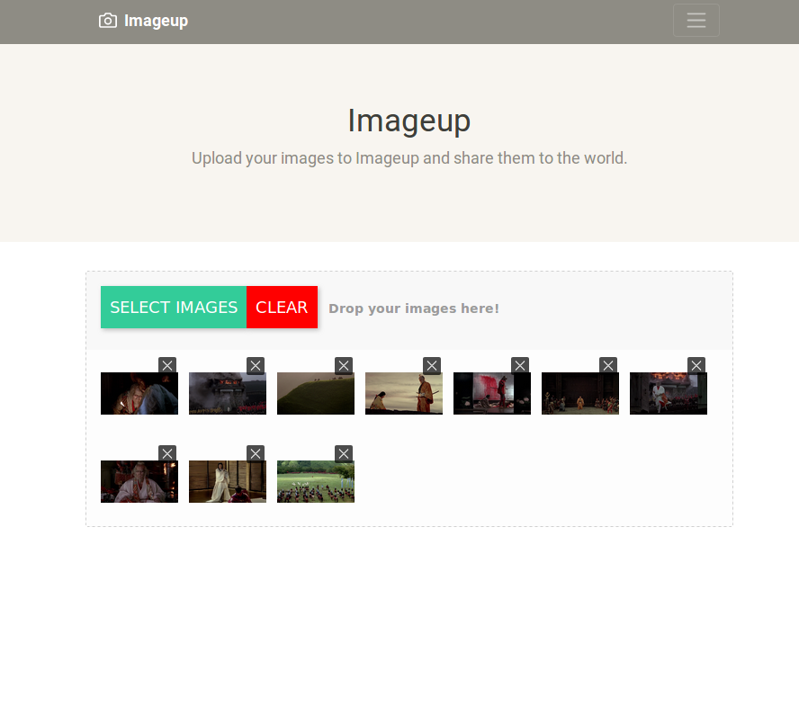

# Imageup



Image uploader using MEAN stack
## Table of content

- [Getting Started](#getting-started)
    - [Built With](#built-with)
    - [Prerequisites](#built-with)
    - [installing](#installing)
    - [For OSX and Linux](#for-osx-and-linux)
- [Run Imageup](#run-imageup)
- [Credits](#credits)
- [License](#license)


# Getting Started

<These instructions will get you a copy of the project up and running on your local machine for development and testing purposes. See deployment for notes on how to deploy the project on a live system.>

## Built With

<Frameworks used>

* [Mongodb](https://www.mongodb.com/) - NoSQL database program, MongoDB uses JSON-like documents with schemas
* [Express](http://expressjs.com/) - Fast, unopinionated, minimalist web framework for Node.js
* [Angular](https://angular.io/) - The web framework used
* [Node](https://nodejs.org/) - Node is designed to build scalable network applications.
## Prerequisites

<What things you need to install the software and how to install them>

Check first for at least node 9.2.0, npm 5.5.1:
```
nodejs -v
npm -v
```
npm is bundled with Node.js, so to install npm you only need to install Node.js on your Ubuntu/Debian
```
curl -sL https://deb.nodesource.com/setup_9.x | sudo -E bash -
sudo apt-get install -y nodejs
```
## Installing

1. Fork this repo by clicking **Fork** button in top-right corner of this web page. Continue to follow instruction steps from your own imageup repo.
2. Clone your own "imageup" repo. Copy the link from the "Clone or download" button near the top right of this repo's home page.
3. The rest of these steps must be done from your machine's command line.

## For OSX and Linux

1. From the desired directory you wish to copy the "imageup" folder with source files to.
    ```
    git clone {paste your own repo link here}
    ```
    NOTE: Please use `develop` branch for contributing.
    ```
    git clone -b develop {paste your own repo link here}
    ```
2. Change directories to imageup:
    ```
    cd imageup
    ```
3. Make sure you have the [pre-requisites](#Prerequisites) [NodeJS](https://nodejs.org/) (v8.4.0 or higher) and [npm](https://www.npmjs.com/) (5.4.1 or higher) installed.

4. Install dependencies from within imageup/server directory:
    ```
    npm install
    ```
5. Install dependencies from within imageup/client directory:
  ```
  npm install
  ```


# Run imageup

If you wan test it in localhost, run a mongo instance, server and client:
```
sudo mongod
```
For both server and client run:
```
npm start
```

Serves the front-end on http://localhost:4200
Serves the api on http://localhost:3000


# Credits

Arnau Díaz. diazarnau@gmail.com

# License

MIT
